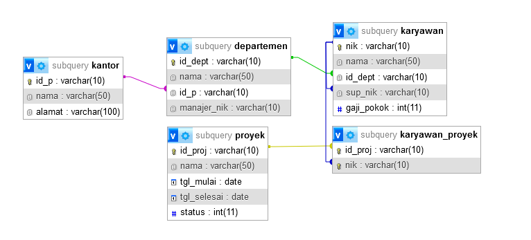
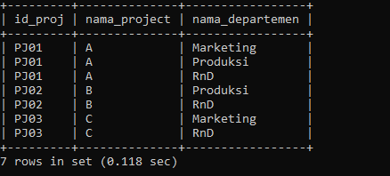
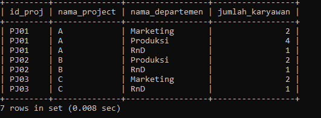
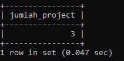
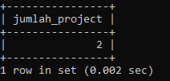
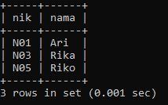

# MYSQL6 - Pertemuan ke 14
# Tugas Praktikum6 { Pertemuan ke 14 } 


|**Nama**|**NIM**|**Kelas**|**Matkul**|
|----|---|-----|------|
|Rafflianda Barus|312310477|TI.23.A.5|Basis Data|

# TABEL


### 1. Departemen apa saja yang terlibat dalam tiap-tiap project

```sql
SELECT
  pj.id_proj,
  pj.nama as nama_project,
  d.nama as nama_departemen
FROM proyek pj
JOIN karyawan_proyek pj_d ON pj.id_proj = pj_d.id_proj
JOIN karyawan k ON pj_d.nik = k.nik
JOIN departemen d ON k.id_dept = d.id_dept
GROUP BY pj.id_proj, pj.nama, d.nama
ORDER BY pj.id_proj, d.nama;
```



### 2. Jumlah karyawan tiap departemen yang bekerja pada tiap-tiap project

```sql
SELECT
  pj.id_proj,
  pj.nama as nama_project,
  d.nama as nama_departemen,
  COUNT(k.nik) as jumlah_karyawan
FROM proyek pj
JOIN karyawan_proyek pj_d ON pj.id_proj = pj_d.id_proj
JOIN karyawan k ON pj_d.nik = k.nik
JOIN departemen d ON k.id_dept = d.id_dept
GROUP BY pj.id_proj, pj.nama, d.nama
ORDER BY pj.id_proj, d.nama;
```



### 3. Ada berapa project yang sedang dikerjakan oleh departemen RnD? (ket: project berjalan adalah yang statusnya 1)

```sql
SELECT
  COUNT(DISTINCT pj.id_proj) as jumlah_project
FROM proyek pj
JOIN karyawan_proyek pj_d ON pj.id_proj = pj_d.id_proj
JOIN karyawan k ON pj_d.nik = k.nik
JOIN departemen d ON k.id_dept = d.id_dept
WHERE d.nama = 'RnD' AND pj.status = 1;
```



### 4. Berapa banyak project yang sedang dikerjakan oleh Ari?

```sql
SELECT
  COUNT(DISTINCT pj.id_proj) as jumlah_project
FROM proyek pj
JOIN karyawan_proyek pj_d ON pj.id_proj = pj_d.id_proj
JOIN karyawan k ON pj_d.nik = k.nik
WHERE k.nama = 'Ari';
```



### 5. Siapa saja yang mengerjakan project B?

```sql
SELECT
  k.nik,
  k.nama
FROM karyawan k
JOIN karyawan_proyek pj_d ON pj_d.nik = k.nik
JOIN proyek pj ON pj.id_proj = pj_d.id_proj
WHERE pj.nama = 'B';
```

